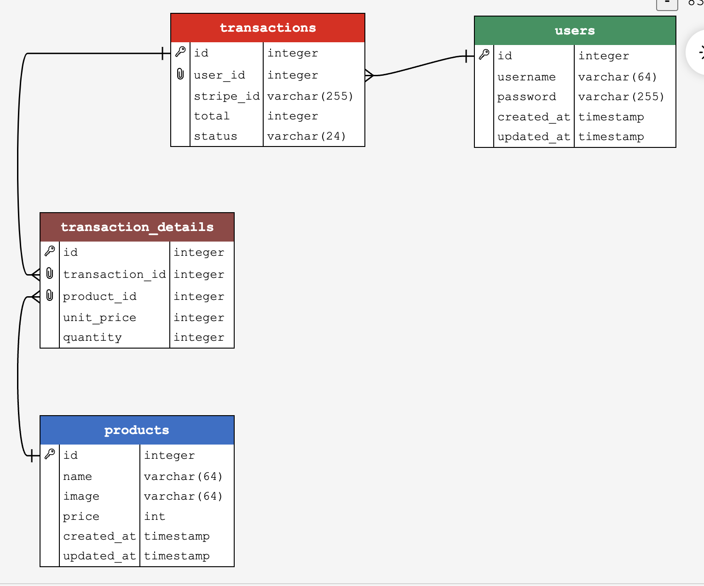

# README

There are mainly two pages for you to read documentations:

1. https://stripe.com/docs/checkout/quickstart

2. https://stripe.com/docs/payments/checkout/fulfill-orders

# How to start

1. Fill in your **.env** for Database's credentials
2. Run `yarn data` to initialize database and dummy data
3. Register account at stripe and copy sceret key at dashboard to **.env**'s STRIPE_SECRET (Remember to toggle test mode)
4. Install Stripe CLI and login using `stripe login`
5. Run `stripe listen --forward-to localhost:8080/webhook` to forward events to your local server.
6. Copy webhook signing secret and paste into **.env**'s STRIPE_ENDPOINT
7. Run `yarn dev` to start server

# Keypoints

- `user_id` is assumed to be 1.
- Endpoint: `POST /webhook` must be placed before middleware `express.json()`.This is necessary because the Stripe webhook requires the raw request body for signature verification, which would be processed incorrectly if parsed by express.json().

- On checking out, a new transaction with status `in progress` is created with details record in transaction_details table
- The new transaction's id is sent to Stripe as metadata
  ```ts
  const metadata = {
    transaction_id: transaction_id,
  };
  ```
- Upon successful payment with Stripe, Stripe CLI forward events to http://localhost:8080/webhook. (You have to do step 4&5 in # how to start )
- In the `payment_intent.succeeded` event,you can retrieved the transaction_id previously stored in metadata

  ```ts
  const paymentIntentSucceededObject = event.data.object;
  await client.query(
    `UPDATE transactions SET status = 'completed',stripe_id = '${paymentIntentSucceededObject.id}' WHERE id = ${paymentIntentSucceededObject.metadata.transaction_id}`
  );
  ```

  - `paymentIntentSucceededObject.id` is Stripe's reference number
  - `paymentIntentSucceededObject.metadata.transaction_id` is your internal database transaction id

    Thus you can update the corresponding transaction status into `completed` using the metadata transaction_id.

# Exercise

1. After payment success ,the total of the transaction is not recorded. Please correct such mistakes.

# ERD(for reference)


